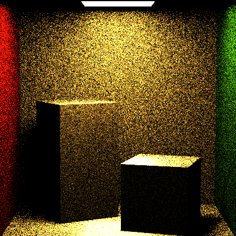
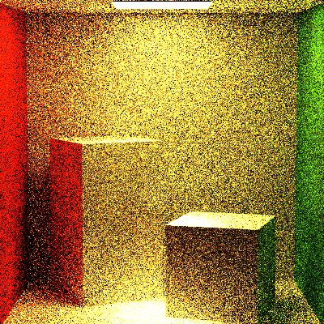
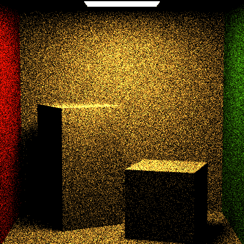
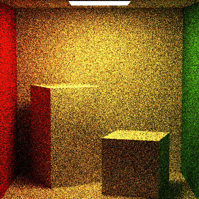
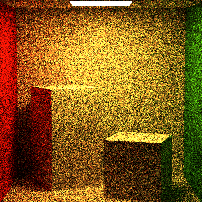
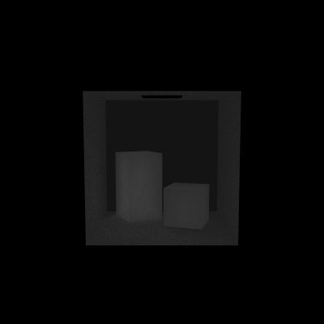
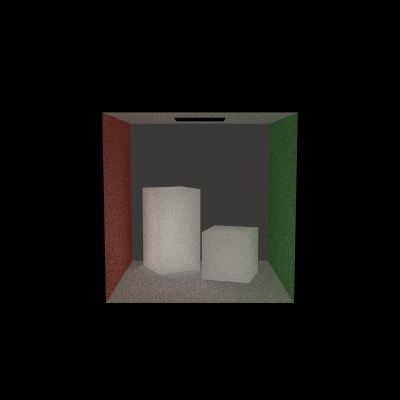

# CIS561_HW4 Path Tracer Episode I: The Hemisphere-Sampling Menace

### Uniform Hemisphere Sampling

#### 1 recursion

#### 5 recursion

### Cosine Weighted Hemisphere Sampling

#### 1 recursion

#### 5 recursion

#### 10 recursion

The UI only allows 10 recursion...

###Debugs

This homework, well, at first it look like this, the camera's FOV is not right when rendering. 
Thanks to Hanming, who helped me a lot in debugging, I finally got it solved, and got the pdf and workflow in a right way. 

